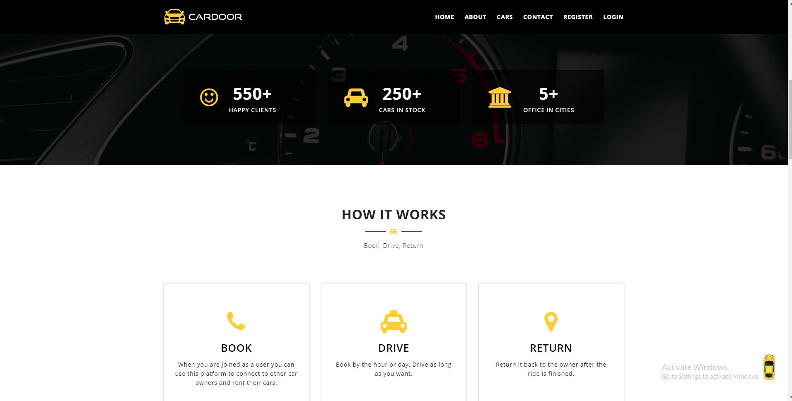

Project Developed By - 
Ahnaf Atef Khan
Ahsan Sadman Khan
Syed Tasdiq
 

Project Name - 'CARDOOR'

Project Introduction - 

'CARDOOR' is an online car sharing/booking system. 
'CARDOOR' offers you the option to put up you car for rent, and potential customers can rent your car at a fixed upon hourly rate charge. 

Homepage -

Gallery-

About US -

Contact US -

**How to set up the code**

1. Install [Node.js](https://nodejs.org/en/download/) and [MongoDB](https://www.mongodb.com/download-center?jmp=nav) on your computer

2. Install MongoDB and make sure the database server is running.

   https://www.mongodb.com/download-center/community

3. Download this code, and from command prompt run:

   `npm install`

4. To run the code, run:

    `nodemon`

    
5. In the browser open http://localhost:3000, and you should see the index page

